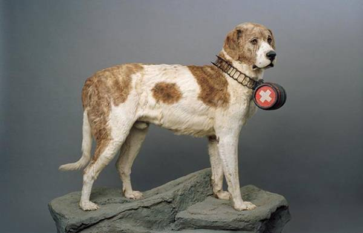

## Barry
*** Everywhere Tracking ***

Barry is the GPS tracking system and The applications will helps accidents in trekking.



URL: https://barry.dog

### Start
```bash
yarn start
```

### PR
Before PR, you must lint with `./lint.sh` execution.

### Tech
Barry uses those following technologies.
- Single page application used by React and Redux
- Serverless with firebase
- [WIP] React Native?
